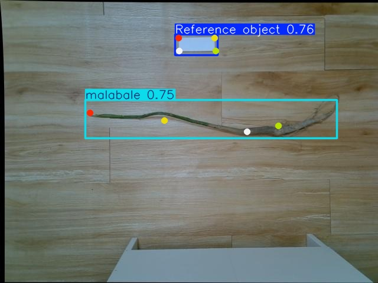

# Automated Measurement of Pachira Aquatica Seedling Length (YOLOv11-Pose)

This repository uses **YOLOv11-pose** to detect 8 keypoints (4 on the seedling + 4 on a reference object) of *Pachira aquatica* seedlings. The system converts images into measurable geometric information and automatically outputs segment and total length (px → cm/mm), together with visualization overlays and evaluation scripts, forming a fully reproducible end-to-end measurement pipeline.


## 1. Problem & Motivation

In commercial grading and quality control, seedling length is usually measured manually with a ruler. This process is time-consuming and subject to human judgment, fatigue, and inconsistency.

This project replaces manual measurement with **keypoint-based detection**:

* From a seedling image, detect 8 keypoints (4 on the plant, 4 on a reference object).
* Use the reference keypoints to estimate a scale factor (pixels → real-world units).
* Compute segment lengths and total length of the seedling.

The goal is to reduce labor, improve consistency, and provide a clear and reproducible digital pipeline from image to measurement.


## 2. Demo (Visualization)

Example visualization of keypoints and length overlays:

> File: `keypoints_overlay.jpg`



The overlay shows:

* Keypoints on the seedling and the reference object.
* Lines representing the measured segments.
* Text annotations summarizing estimated lengths.


## 3. Method Overview (Pipeline)

High-level pipeline:

1. **Keypoint Detection**: YOLOv11-pose predicts 8 keypoints for each image.
2. **Scale Calibration**: The 4 keypoints on the reference object are used to compute a pixel-to-length scale (px → cm/mm).
3. **Length Computation**: Segment and total lengths along the seedling are computed from the keypoints.
4. **Outputs**: Numerical results (e.g., JSON/CSV) and visual overlays (images) for downstream use in grading, QC, or research.


## 4. Repository Structure

> Some scripts are used for training/inference, others for data processing and analysis. Below is a grouped overview of the most relevant files.

```text
.
├── runs/pose/                       # Ultralytics training/inference outputs (logs, plots, predictions)
├── weights/                         # Trained weights (e.g., best.pt, final.pt)
├── environment.yml                  # Conda environment specification (recommended for reproducibility)
├── yolo11m-pose.pt                  # Initial / pretrained YOLOv11-pose weights (if used)
├── train.py                         # Main training entry
├── predict.py / predict2.py         # Inference scripts (keypoints + visualization)
├── evaluate.py                      # Evaluation script (mAP and/or length error)
├── length.py / length2.py           # Length computation from keypoints (scale + segment/total length)
├── labelme.py                       # Annotation format conversion / processing (e.g., LabelMe JSON → training format)
├── cutpic.py                        # Image cropping / dataset organization utilities
├── merge1.py / merge2.py            # one-shot inference + length (with custom trained weights)
├── featuremap.py                    # Feature-map extraction / visualization
├── analyze_feature_maps.py          # Feature-map statistics / analysis
├── layer.py / convolution1.py       # Layer- or convolution-related experiments / visualizations
├── PRmAP@75.py / mAPgogo.py         # PR curves and mAP calculation / aggregation
└── test.py / pretest.py / modeltest.py / readimage.py / index.py / line1.py
                                   # Experimental / test scripts (not required for the main pipeline)
```


## 5. Environment Setup (Anaconda)

This project is designed to run in a Conda environment. The recommended setup is provided in `environment.yml`.

### 5.1 Create and Activate Conda Environment

```bash
# Create environment from environment.yml
conda env create -f environment.yml

# Activate the environment
conda activate <your_env_name>
```

Replace `<your_env_name>` with the name specified inside `environment.yml` (e.g., `pachira-length`).

If you prefer manual installation with `pip`, you can inspect `environment.yml` and install the listed packages, but for exact reproducibility the Conda environment is strongly recommended.


## 6. Quickstart

### 6.1 One-shot Inference + Length (Primary Usage)

For most users, the simplest way to use this repository is to run merge1.py, which performs detection and length measurement in a single step.

Open merge1.py and update the internal model / weights path to point to your own trained checkpoint (e.g., weights/best.pt).

Then run:

python merge1.py

This script will:

Load your trained YOLOv11-pose model.

Run inference on the configured input images/folder.

Perform scale calibration using reference keypoints.

Directly output predicted segment and total length results (and, optionally, visualization images).

### 6.2 Training (Keypoint Model)

Train YOLOv11-pose on the Pachira seedling dataset:

python train.py

After training, outputs (including logs, plots, and model weights) will usually be stored under runs/pose/ or weights/, depending on the configuration inside train.py.
  
### 6.3 Inference Only (Keypoint Prediction)

If you want to run keypoint detection separately (without length computation):

python predict.py
or
python predict2.py

Typical outputs:

Visualization images with keypoints and skeletons overlaid.

Saved keypoint coordinates (format depends on your script implementation).

### 6.4 Length Measurement (px → cm/mm)

After obtaining keypoints, compute physical length:

```bash
python length.py
# or
python length2.py
```

These scripts:

* Read the predicted keypoints (and/or perform detection internally).
* Use the reference object keypoints to estimate a scale factor.
* Compute segment and total length for each seedling.
* Save numerical results and, optionally, overlay images.


### 6.5 Evaluation

Evaluate the model on a validation/test split:

```bash
python evaluate.py
```

For further analysis such as PR curves and mAP at specific IoU thresholds (e.g., 0.75):

```bash
python PRmAP@75.py
python mAPgogo.py
```

These scripts are intended mainly for research and result visualization.


## 7. Script Guide (What Each Script Does)

### 7.1 Core Pipeline (Main Entry Points)

* **`train.py`**
  Train the YOLOv11-pose keypoints model on the Pachira dataset. Handles data loading, training loop, logging, and saving weights and metrics.

* **`predict.py`, `predict2.py`**
  Perform inference on images or folders. Output keypoints, optionally draw skeletons and text overlays, and save visualized images.

* **`length.py`, `length2.py`**
  Convert keypoint coordinates into physical lengths. These scripts use reference-object keypoints for scale calibration, then compute segment and total seedling length.

* **`evaluate.py`**
  Evaluate trained models on validation or test sets, computing metrics such as mAP (for keypoints) and/or error metrics for length estimation.

### 7.2 Data & Annotation Tools

* **`labelme.py`**
  Convert or preprocess annotations (e.g., from LabelMe JSON to the format expected by YOLOv11-pose or custom training scripts).

* **`cutpic.py`**
  Auxiliary script for image cropping, resizing, or organizing dataset images.

* **`merge1.py`, `merge2.py`**
  Merge datasets or annotation files from multiple collection batches into a unified training set.

### 7.3 Analysis & Debugging

* **`featuremap.py`, `analyze_feature_maps.py`, `layer.py`, `convolution1.py`**
  Scripts for extracting feature maps, analyzing channel activations, and visualizing intermediate CNN outputs, useful for debugging and interpretability.

* **`channel_activation_summary.csv`**
  Example output file containing feature-map statistics.

* **`PRmAP@75.py`, `mAPgogo.py`**
  Generate precision–recall curves, compute mAP, and summarize detection performance for reporting.

### 7.4 Experimental / Legacy Scripts

* **`test.py`, `pretest.py`, `modeltest.py`, `readimage.py`, `index.py`, `line1.py`**
  Experimental or legacy test scripts used during development. They are not part of the main pipeline but may be helpful as references.


## 8. Keypoints Convention (Recommended Documentation)

This project uses 8 keypoints per object:

* **Seedling keypoints**: `P1, P2, P3, P4`
* **Reference keypoints**: `R1, R2, R3, R4`

It is strongly recommended to document, in your paper/report or an additional figure, the exact anatomical meaning of each keypoint (e.g., cut surface of the root, nodes, apical bud, and four corners of the reference object). This ensures that annotations and measurements remain consistent and reproducible.


## 9. Outputs

Typical outputs include:

* `runs/pose/`
  Training logs, learning curves, validation results, and prediction visualizations created by the Ultralytics/YOLO framework.

* `weights/`
  Trained model weights (e.g., `best.pt`, `last.pt`), ready for deployment or further fine-tuning.

* Example visualization:
  `keypoints_overlay.jpg` shows the combined result of detection and measurement overlay.

Depending on how you configure the scripts, you may also generate JSON/CSV files containing per-image length measurements.


## 10. Reproducibility Checklist

To make experiments reproducible and comparable:

* Use the provided `environment.yml` to recreate the Conda environment.
* Record the versions of Python, PyTorch, CUDA, and the YOLO/Ultralytics library.
* Fix random seeds (if supported in your training script) to reduce variance between runs.
* Split training/validation/test sets **by seedling identity**, not just by image, so that images of the same physical plant do not leak into both training and test sets.


## 11. License

This project is released under the **MIT License** (see `LICENSE`).


